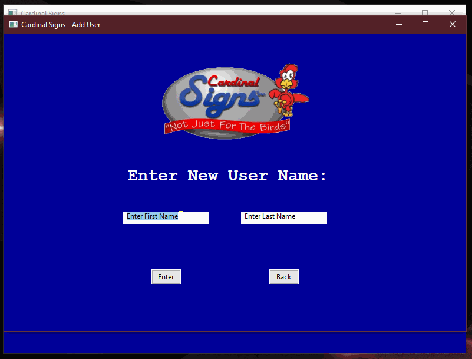

# csTimeclock
A WxWidgets C++ application which was built for Cardinal Signs Inc which allows employees to sign in and log their hours of work. The application is capable of keeping track of multiple users and exporting employee reports. 

## _**NBA-Wager&Stats-Database**_

